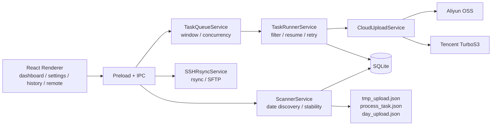

# Data Collection Uploader

[English](README.md) | [简体中文](README.zh-CN.md)


Data Collection Uploader is an Electron desktop application for reliably archiving
industrial collection data to Aliyun OSS, Tencent TurboS3, or both clouds. It discovers
stable welding-session directories, schedules resumable upload tasks, tracks each cloud
independently, and closes completed date directories for retention and cleanup.

[Read the documentation](docs/README.md)

## What You Can Do

- Scan one or more data roots organized as `YYYY-MM-DD/work-session/files`.
- Automatically scan only the current date directory on startup; old dates are added manually.
- Treat only directories matching the work-session name pattern as automatic tasks, with `HH-MM-SS` as the default.
- Wait for repeated size and modification-time checks before uploading a file.
- Use project Profiles to bind scan roots, file filters, target providers, and object-key rules.
- Upload each Profile to Aliyun only, Tencent only, or both providers.
- Track progress, errors, completion, and retries independently for each provider.
- Pause, resume, cancel, and retry an individual failed cloud destination.
- Restrict new task starts to a daily or overnight upload window.
- Pull remote data with `rsync`, or send smaller remote files directly through SFTP.
- Keep task, destination, file, date-summary, settings, and remote-machine state in SQLite.
- Delete completed local data after a configurable retention period.

## Upload Model

Configure the parent directory of the date folders in an upload Profile:

```text
/data/upload-root/
  2026-06-18/
    04-39-04/
      camera1/0001.jpg
      metadata.json
```

Automatic scanning only processes the current valid `YYYY-MM-DD` date directory. A direct
child directory becomes a continuous upload task only when its name matches the configured
work-session pattern, which defaults to `^\d{2}-\d{2}-\d{2}$`. Non-matching directories
such as `teach` are recorded as ignored directories and can be manually restored. Old date
directories are not auto-discovered; add a specific work-session directory manually when
historical data needs to be uploaded.

Files placed directly in the date folder are not uploaded. New or modified files inside a
work-session directory are uploaded after they become stable and overwrite the same object
key in the cloud.

Each Profile can define separate prefixes and path modes for Aliyun and Tencent. With
`upload/` as the prefix and the date/work-session path mode, object keys are:

```text
upload/2026-06-18/04-39-04/camera1/0001.jpg
upload/2026-06-18/04-39-04/metadata.json
```

The selected Profile is snapshotted when a task is created, including target providers,
file filters, prefixes, path modes, and object-key templates. Later Profile changes affect
new tasks only. In dual-cloud mode, a logical file and task complete only after both
destinations complete. Retrying one failed destination does not resend files that already
succeeded on the other provider.

After the date has passed and every discovered work session is complete or explicitly
skipped, `day_upload.json` is written in the date directory. To backfill an old date, add
the specific work-session directory manually; the date summary is recalculated after the
backfill completes.

## Cloud Providers

| Provider | Client and behavior |
| --- | --- |
| Aliyun OSS | `ali-oss`; streaming upload for small files and multipart upload for large files |
| Tencent TurboS3 | AWS SDK v3 S3 client; Signature V4, path-style requests, and multipart upload |

Tencent TLS certificate verification is enabled by default. The insecure TLS option is
intended only for a controlled environment that uses an unverifiable self-signed
certificate.

Connection tests list at most one object from the configured bucket. A successful test
does not replace the need for object-write and multipart-upload permissions.

## Remote Transfer

| Feature | Behavior |
| --- | --- |
| `rsync` | Pulls to a local directory, then creates a normal resumable task using the machine Profile |
| SFTP | Reads each remote file into memory and uploads it using the machine Profile |

SFTP operations return a result for each provider, but they do not create normal
task-history records. For large files or unreliable networks, prefer `rsync` so the
regular task runner can use local recovery and multipart uploads.

## Install and Run

Requirements:

- Node.js 18 or later; Node.js 20 LTS is recommended
- npm 9 or later
- Linux or Windows
- Credentials with access to at least one configured object-storage bucket
- Optional: `rsync` and `sshpass` for remote pull workflows

```bash
npm install
npm run dev
```

In **Settings**:

1. Configure and test the Aliyun or Tencent credentials.
2. In **Project Profile**, choose target providers, scan roots, suffix filters, and path rules.
3. Set the default Profile when needed; manual folder add and new SSH machines use it by default.
4. Adjust task, per-task file, and global file concurrency.
5. Configure or disable the upload time window.
6. Return to the dashboard and trigger a scan. Use manual folder add plus a Profile for old dates.

## Common Commands

```bash
npm run dev
npm test
npm run typecheck
npm run lint
npm run build
npm run preview
npm run build:linux
npm run build:win
npm run build:all
```

Build output is written to `dist/`. The current application version is `2.2.0`.

## Architecture



The dashboard and history pages expose separate Aliyun and Tencent views. SQLite stores
logical tasks plus per-provider task and file destinations, while marker files keep
recovery and operational state beside the collected data.

## Data and Logs

- Database: `uploader.db` under Electron's `userData` directory
- Logs: `userData/logs` by default
- Task markers:
  - `tmp_upload.json`: the work-session directory has been registered
  - `process_task.json`: logical and per-provider upload state
  - `day_upload.json`: the past date directory is fully complete

See the [documentation index](docs/README.md) for architecture, configuration, workflows,
IPC contracts, storage details, and troubleshooting.

## License

This project is licensed under the [MIT License](LICENSE).
