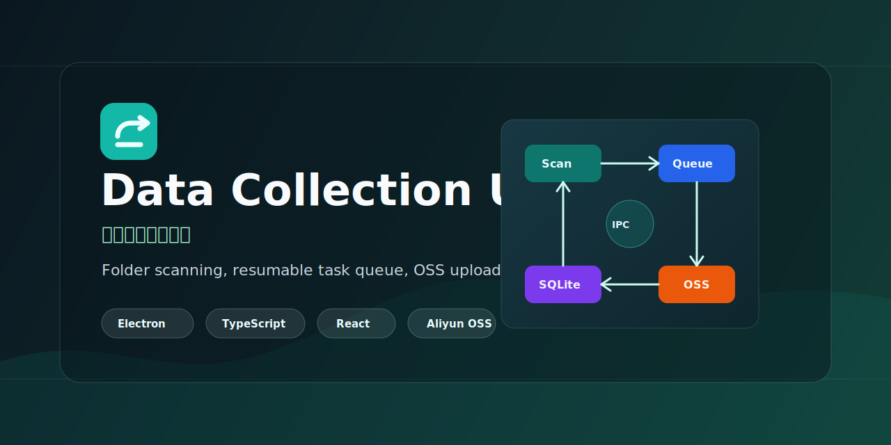
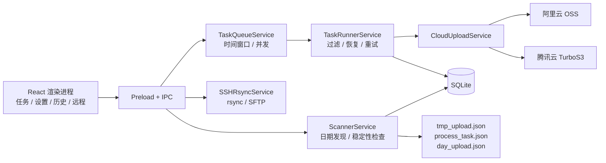

# 数据采集上传工具

[English](README.md) | [简体中文](README.zh-CN.md)



数据采集上传工具是一款 Electron 桌面应用，用于将工业采集数据可靠归档到阿里云
OSS、腾讯云 TurboS3，或同时上传到两个云端。应用持续监控工作次目录，文件稳定后
立即增量上传，独立记录每个云端的状态，并在日期目录跨天且全部同步后封账。

[阅读完整文档](docs/README.md)

## 可以完成什么

- 扫描一个或多个按 `YYYY-MM-DD/工作次目录/文件` 组织的数据根目录。
- 启动后只自动扫描当天日期目录；旧日期补传需要手动添加具体工作次目录。
- 使用文件事件和周期校准持续发现新增、修改和删除的文件。
- 文件大小与修改时间连续稳定后增量上传，已同步目录后续变化会自动重新同步。
- 通过项目 Profile 绑定扫描目录、文件过滤、目标云和对象路径策略。
- 每个 Profile 支持仅阿里云、仅腾讯云和阿里腾讯双云上传。
- 分云记录进度、错误、完成状态和重试状态。
- 支持暂停、恢复、跳过，以及只重试失败的单个云端。
- 使用每日或跨午夜时间窗口限制新任务启动。
- 通过 `rsync` 拉取远程数据，或通过 SFTP 直传较小的远程文件。
- 使用 SQLite 保存任务、云端目标、文件、日期汇总、设置和远程机器状态。
- 按配置的保留天数删除已完成的本地数据。

## 上传模型

应在项目 Profile 中配置日期目录的父级数据根目录：

```text
/data/upload-root/
  2026-06-18/
    04-39-04/
      camera1/0001.jpg
      metadata.json
```

自动扫描只处理当天的有效 `YYYY-MM-DD` 日期目录。日期目录中匹配工作次正则的直接
子目录会成为持续同步任务，默认正则为 `^\d{2}-\d{2}-\d{2}$`。不匹配的直接子目录
会登记为“已忽略目录”，可在界面中手动恢复上传；旧日期目录不会自动发现新任务，
需要补传时通过“手动添加目录”选择具体工作次目录。

目录内部新增或修改的文件稳定后会上传到同一相对路径；日期目录根部的普通文件不会上传。

每个 Profile 可以为阿里云和腾讯云分别配置 Prefix 与上传路径模式。Prefix 为
`upload/` 且使用日期/工作次路径时，对象路径为：

```text
upload/2026-06-18/04-39-04/camera1/0001.jpg
upload/2026-06-18/04-39-04/metadata.json
```

任务创建时会锁定所选 Profile 的快照，包括目标云、文件过滤、Prefix、路径模式和
对象 Key 模板。后续修改 Profile 只影响新任务。双云模式下，逻辑文件和任务必须在
两个云端都完成后才算完成。只重试失败云端时，不会重传另一个云端已经成功的文件。

系统日期跨天且所有已发现的工作次目录都已同步或明确跳过后，会在日期目录写入
`day_upload.json`。旧日期需要补传时，手动添加具体工作次目录；补传完成后日期汇总
会重新计算封账状态。

未上传完成的源目录被外部删除时，任务会立即停止并标记为“已跳过（源目录已删除）”。
该状态不会冒充上传成功，但不会继续阻塞日期封账。

## 云存储

| 云端 | 客户端与行为 |
| --- | --- |
| 阿里云 OSS | 使用 `ali-oss`；小文件流式上传，大文件分片上传 |
| 腾讯云 TurboS3 | 使用 AWS SDK v3 S3 client；S3 V4 签名、path-style 请求和分片上传 |

腾讯云默认校验 TLS 证书。“不安全 TLS”仅用于受控环境中无法验证的自签名证书。

连接测试会尝试从配置的 Bucket 最多列出一个对象。测试成功不代表已具备对象写入和
分片上传权限。

## 远程传输

| 功能 | 行为 |
| --- | --- |
| `rsync` | 先拉取到本地目录，再按机器绑定的 Profile 创建普通可恢复上传任务 |
| SFTP | 将每个远程文件读入内存，并按机器绑定的 Profile 直传云端 |

SFTP 操作会返回每个云端的结果，但不会创建普通任务历史。大文件或不稳定网络建议
使用 `rsync`，让普通任务执行器接管本地恢复和分片上传。

## 安装与运行

环境要求：

- Node.js 18+，建议 Node.js 20 LTS
- npm 9+
- Linux 或 Windows
- 至少一个已配置对象存储 Bucket 的访问凭据
- 可选：远程拉取所需的 `rsync` 和 `sshpass`

```bash
npm install
npm run dev
```

进入“设置”页：

1. 配置并测试阿里云或腾讯云连接凭据。
2. 在“项目 Profile”中选择目标云、扫描目录、文件后缀过滤和上传路径模式。
3. 根据需要设置默认 Profile；手动添加目录和新建 SSH 机器默认使用它。
4. 调整任务并发、单任务文件并发和全局文件并发。
5. 配置或关闭上传时间窗口。
6. 返回任务面板并触发扫描；旧日期补传使用“手动添加目录”并选择 Profile。

## 常用命令

```bash
npm run dev
npm test
npm run typecheck
npm run lint
npm run build
npm run preview
npm run build:linux
npm run build:win
npm run build:all
```

构建产物输出到 `dist/`。当前应用版本为 `2.2.0`。

## 系统架构



任务面板和历史页分别提供阿里云、腾讯云视图。SQLite 同时保存逻辑任务以及分云任务
和文件目标，标记文件则把恢复与现场观测状态保存在采集数据旁边。

## 数据与日志

- 数据库：Electron `userData` 目录下的 `uploader.db`
- 日志：默认位于 `userData/logs`
- 任务标记：
  - `tmp_upload.json`：工作次目录已登记
  - `process_task.json`：逻辑任务和分云上传状态
  - `day_upload.json`：已跨天日期目录全部完成

架构、配置、工作流、IPC 契约、存储结构和故障排查见[完整文档](docs/README.md)。

## 许可证

本项目基于 [MIT License](LICENSE) 开源。
