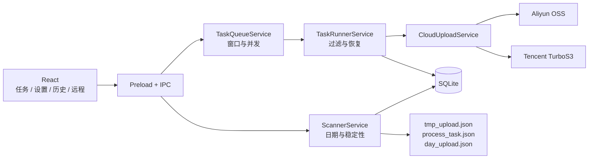

# 数据采集上传工具

> 面向工业数据采集现场的日期目录发现、任务化双云上传、远程同步与标注导出桌面工具

## 项目简介

应用以“数据根目录 / 日期 / 单次焊接”为基本数据模型。扫描器只识别数据根目录下
有效的 `YYYY-MM-DD` 日期目录，并在其中的直接子目录稳定后创建上传任务。

任务可上传到阿里云 OSS、腾讯云 TurboS3，或同时上传到两个云端。双云任务分别保存
每个云端的文件进度、错误和完成状态；只有所有选定云端完成后，逻辑任务、日期封账
和自动清理条件才成立。

## 核心功能

- **日期目录扫描**：识别 `YYYY-MM-DD/单次焊接`，通过多轮快照确认目录稳定。
- **日期汇总封账**：跨天且全部子任务完成后写入 `day_upload.json`；迟到目录会重开。
- **双云上传**：支持仅阿里、仅腾讯和双云模式，并锁定任务创建时的模式和 Prefix。
- **分云恢复**：按云端展示进度和历史，只重试失败端，不重传已成功端。
- **任务调度**：支持时间窗口、任务并发、单任务文件并发和全局上传并发。
- **远程同步**：支持 SSH 测试、`rsync` 拉取落盘和 SFTP 多云直传。
- **图片标注**：导出 PNG + JSON，并上传到当前启用的云端。
- **状态持久化**：SQLite 保存任务、文件、云端目标、日期汇总、设置和远程机器。
- **自动清理**：按保留天数清理已封账日期目录及符合条件的独立任务目录。

## 数据路径

```text
/data/upload-root/
  2026-06-18/
    04-39-04/
      camera1/0001.jpg
      metadata.json
```

若某云端 Prefix 为 `upload/`，对象路径为：

```text
upload/2026-06-18/04-39-04/camera1/0001.jpg
```

日期目录根部文件不会成为任务；单个焊接目录完成后不再检测内部增量。新增数据必须
创建新的焊接子目录。

## 系统架构



## 快速导航

- [环境依赖与准备](guide/prerequisites.md)
- [开发运行](guide/run-app.md)
- [安装与打包](guide/package-install.md)
- [架构总览](architecture/README.md)
- [目录扫描器](modules/scanner.md)
- [任务队列与上传执行](modules/task-upload.md)
- [双云上传服务](modules/oss.md)
- [云存储配置](configuration/oss-config.md)
- [本地目录上传](workflow/local-upload.md)
- [远程机器同步](workflow/remote-sync.md)
- [测试验收流程](workflow/testing.md)
- [故障排查](faq/troubleshooting.md)
