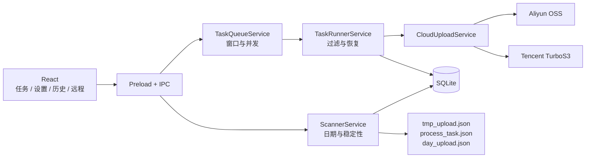

# 数据采集上传工具

> 面向工业数据采集现场的日期目录发现、任务化双云上传与远程同步桌面工具

## 项目简介

应用以“数据根目录 / 日期 / 工作次”为基本数据模型。扫描器启动后只自动处理当天
有效的 `YYYY-MM-DD` 日期目录，并在其中匹配工作次正则的直接子目录稳定后创建上传任务。
旧日期目录不会自动发现新任务，需要补传时手动添加具体工作次目录。

任务可上传到阿里云 OSS、腾讯云 TurboS3，或同时上传到两个云端。双云任务分别保存
每个云端的文件进度、错误和完成状态；只有所有选定云端完成后，逻辑任务、日期封账
和自动清理条件才成立。

## 核心功能

- **当天目录扫描**：只自动识别当天 `YYYY-MM-DD/工作次`，默认工作次名为 `HH-MM-SS`。
- **忽略目录展示**：`teach` 等非工作次目录登记为“已忽略目录”，可手动恢复上传。
- **日期汇总封账**：跨天且全部子任务完成或跳过后写入 `day_upload.json`。
- **项目 Profile**：按项目绑定扫描目录、过滤规则、目标云、Prefix 和对象 Key 规则。
- **双云上传**：支持仅阿里、仅腾讯和双云模式，并锁定任务创建时的 Profile 快照。
- **分云恢复**：按云端展示进度和历史，只重试失败端，不重传已成功端。
- **任务调度**：支持时间窗口、任务并发、单任务文件并发和全局上传并发。
- **远程同步**：支持 SSH 测试、`rsync` 拉取落盘和 SFTP 多云直传。
- **状态持久化**：SQLite 保存任务、文件、云端目标、日期汇总、设置和远程机器。
- **自动清理**：按保留天数清理已封账日期目录及符合条件的独立任务目录。

## 数据路径

```text
/data/upload-root/
  2026-06-18/
    04-39-04/
      camera1/0001.jpg
      metadata.json
```

若某 Profile 的某云端 Prefix 为 `upload/`，并使用日期/工作次路径，对象路径为：

```text
upload/2026-06-18/04-39-04/camera1/0001.jpg
```

日期目录根部文件不会成为任务；工作次目录内部新增或修改文件会持续增量上传。任务
创建时保存 Profile 快照，后续修改 Profile 不会改变已有任务的过滤规则或对象路径。

## 系统架构



## 快速导航

- [环境依赖与准备](guide/prerequisites.md)
- [开发运行](guide/run-app.md)
- [安装与打包](guide/package-install.md)
- [架构总览](architecture/README.md)
- [目录扫描器](modules/scanner.md)
- [任务队列与上传执行](modules/task-upload.md)
- [双云上传服务](modules/oss.md)
- [云存储配置](configuration/oss-config.md)
- [本地目录上传](workflow/local-upload.md)
- [远程机器同步](workflow/remote-sync.md)
- [测试验收流程](workflow/testing.md)
- [故障排查](faq/troubleshooting.md)
