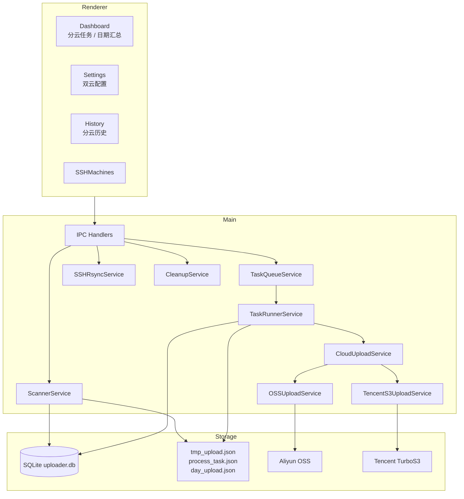

# 架构总览

应用由 React 渲染进程、Preload 安全桥、Electron 主进程、SQLite 和两个对象存储
适配器组成。渲染进程只通过 IPC 使用主进程能力，不直接访问文件系统、数据库或云端
SDK。

## 核心边界

- `ScannerService`：发现当天日期和工作次目录、稳定性检查、忽略目录登记、日期封账。
- `TaskQueueService`：时间窗口和任务级并发。
- `TaskRunnerService`：文件过滤、分云上传、恢复、重试和标记文件。
- `CloudUploadService`：根据提供方选择阿里或腾讯上传适配器。
- `TaskRepo`：逻辑任务和逻辑文件。
- `TaskDestinationRepo`：分云任务、分云文件、进度和错误。
- `DayFolderRepo`：日期汇总、子任务统计和 `day_upload.json` 数据。
- `SSHRsyncService`：`rsync` 落盘任务与 SFTP 多云直传。
- `CleanupService`：优先清理已封账日期目录，再处理符合条件的独立任务。

## 持久化原则

SQLite 是应用查询和恢复的主要状态源；数据目录内的三个 JSON 标记用于扫描去重、
现场排查和跨应用恢复。任务创建时锁定上传模式和 Prefix，保证设置变更不会改变
已存在任务的目标。

旧数据库启动时会自动：

- 为旧逻辑任务创建阿里云 `task_destinations`。
- 为未完成任务文件创建阿里云 `task_file_destinations`。
- 补齐 `upload_target_mode`、`day_folder_id`、`upload_relative_path`。
- 从本地或远程路径推导未完成任务的日期层上传路径。
- 将源目录已删除的未完成任务标记为已跳过，避免启动恢复阻塞。
