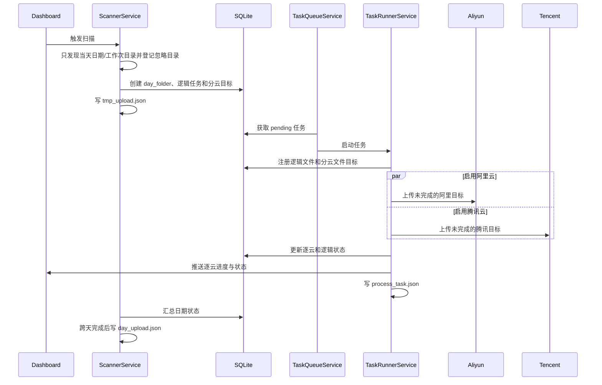
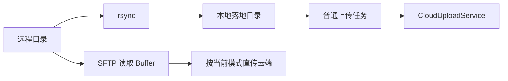

# 数据流

## 自动扫描与双云上传

双云部分失败时，成功目标保持完成；重试只重置指定提供方的失败状态。

## rsync 与 SFTP

`rsync` 进入普通任务链路，拥有 SQLite 状态、标记文件和历史。SFTP 返回逐云结果，
但不创建普通任务历史。

## 进度事件

| 事件 | 内容 |
| --- | --- |
| `task:progress` | `taskId + provider`、文件数、字节数、速度和当前文件 |
| `task:destination-change` | 指定云端的任务状态和错误 |
| `task:status-change` | 逻辑任务状态变化 |
| `day-folder:event` | 日期汇总状态和统计 |
| `scanner:event` | 扫描状态和待稳定目录 |
| `rsync:progress` / `sftp:progress` | 远程传输进度 |
