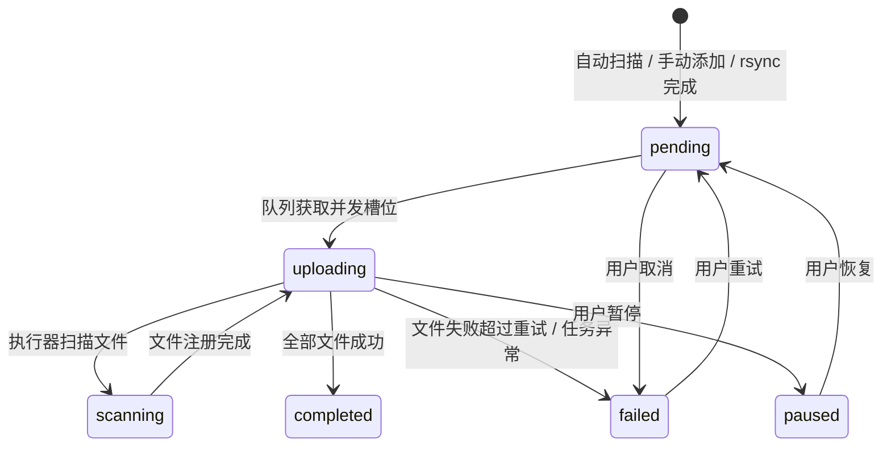

# 状态模型

## 任务状态

任务状态定义在 `src/shared/types.ts`：

| 状态 | 含义 | 典型来源 |
| --- | --- | --- |
| `pending` | 等待队列调度 | 扫描器注册、手动添加、恢复、重试 |
| `scanning` | 执行器正在扫描任务目录中的文件 | `TaskRunnerService.run` 开始后 |
| `uploading` | 文件正在上传 | 队列启动任务后 |
| `completed` | 所有符合规则的文件上传完成 | 执行器无失败文件 |
| `failed` | 任务失败或被取消 | OSS 错误、部分文件失败、用户取消 |
| `paused` | 用户暂停任务 | IPC `task:pause` |

## 状态流转

代码中队列会先把任务改为 `uploading`，执行器内部再进入 `scanning` 并回到 `uploading`。因此界面上可能很快从上传状态切到扫描状态，再进入真正上传。

## 文件状态

| 状态 | 含义 |
| --- | --- |
| `pending` | 文件待上传 |
| `uploading` | 文件正在上传 |
| `completed` | 文件已上传并记录 OSS key |
| `failed` | 文件上传失败，记录错误信息 |

每个逻辑文件在 `task_file_destinations` 中分别保存阿里和腾讯状态。只有任务所选云端全部为 `completed`，逻辑文件才变为 `completed`。

双云部分失败时：

- 成功云端保持 `completed`
- 失败云端保持 `failed`
- 逻辑任务为 `failed`
- 从对应云端标签页重试时只重置该云端

## 标记文件状态

任务目录内会出现两个标记文件：

| 文件 | 写入时机 | 用途 |
| --- | --- | --- |
| `tmp_upload.json` | 目录稳定并被注册为任务时 | 表示该目录已被扫描器处理过 |
| `process_task.json` | 上传过程中和结束时 | 记录任务 ID、文件状态、已上传数量、最终错误 |
| `day_upload.json` | 日期跨天且全部焊接任务完成时 | 记录日期目录汇总和全部子任务清单 |

`tmp_upload.json` 主要服务扫描器去重，`process_task.json` 主要服务现场排查和上传过程观测。

日期目录汇总状态为：

| 状态 | 含义 |
| --- | --- |
| `collecting` | 当天仍可能继续产生焊接目录，或尚无子目录 |
| `processing` | 存在待稳定、等待或上传中的焊接目录 |
| `blocked` | 至少一个焊接任务失败或暂停 |
| `completed` | 日期已跨天且所有已发现焊接任务完成 |

## 上传时间窗口

时间窗口影响的是“是否允许启动新的 pending 任务”，不会停止已经运行的任务。

| 配置 | 行为 |
| --- | --- |
| 开始和结束都为空 | 全天允许启动 |
| 只设置开始 | 每天到达开始时间后允许启动 |
| 只设置结束 | 每天结束时间前允许启动 |
| 开始早于结束 | 例如 `08:00-20:30`，区间内允许启动 |
| 开始晚于结束 | 例如 `20:30-06:00`，跨午夜区间内允许启动 |
| 开始等于结束 | 视为全天允许启动 |

队列还会避免“刚过开始时间后新创建的任务立即启动”。当配置了开始时间时，任务需要早于当前启动周期的开始时刻，才会被本轮调度。
