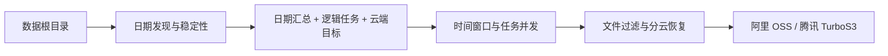

# 模块详解总览

## 主链路

| 阶段 | 模块 |
| --- | --- |
| 日期发现、稳定性、封账 | `ScannerService` + `DayFolderService` |
| 逻辑任务注册 | `TaskRepo` |
| 分云目标注册 | `TaskDestinationRepo` |
| 队列调度 | `TaskQueueService` |
| 上传执行 | `TaskRunnerService` + `CloudUploadService` |

## 旁路能力

| 能力 | 行为 |
| --- | --- |
| 手动添加目录 | 创建 `sourceType=manual` 的普通任务 |
| rsync | 拉取后创建 `sourceType=rsync` 的普通任务 |
| SFTP | 按当前模式直传，返回逐云结果，不创建历史 |
| 数采分析 | 提取工作次目录元信息并广播 |
| 自动清理 | 清理已封账日期目录及符合条件的独立任务 |

对象 key 始终使用 `/`，任务创建时锁定上传模式和各云端 Prefix。
